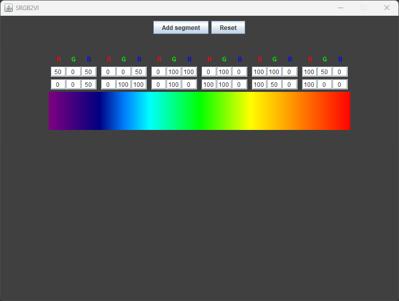

# Segmented RGB intensity to video image (SRGB2VI)
## How do I use it?
You can insert the intensity (0 to 100) of RGB at the start and ending of each segment.
Press the __Enter__ key inside a segment's text box to generate it's respective image.  

    

  

## Why was this made?
I did this small project because I wanted to get a bit familiar with Java before my bachelor's started.
The project idea in specific was inspired by one of the first few assignments I was given at a video systems class I took while studying electronics.
